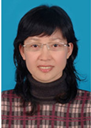
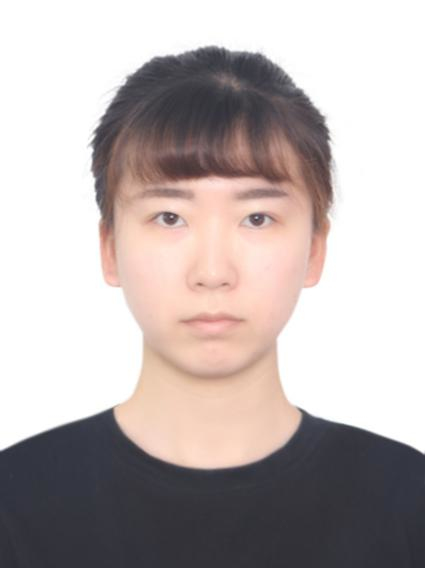
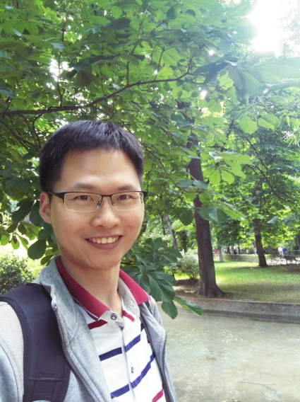
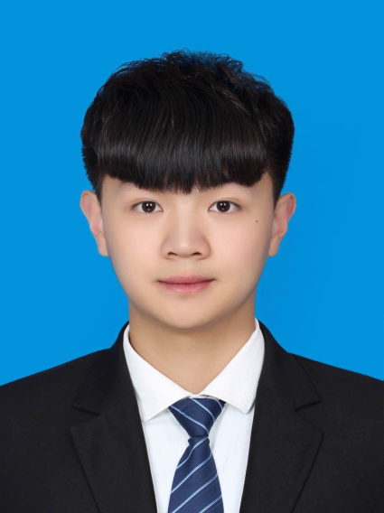
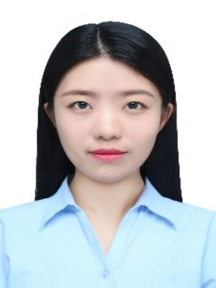
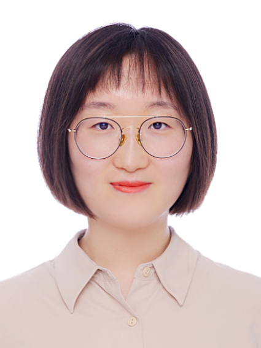

<b>Graphic and Image Research Laboratory</b>

　　
  　　
	　　
	  
> **Faculty**
<table>
    <tr>
        <td> </td>
    </tr>
	<tr>
        <td>
Xiuping Liu
</td>
    </tr>
</table>

> **Ph.D**
<table>
    <tr>
        <td></td>
		<td></td>
		<td></td>
		<td></td>
    </tr>
	<tr>
        <td>
Jun Zhou 2013-present 3D shape analysis
</td>
		  <td>
Yuqiu Kong 2014-present saliency detection
</td>
		 <td>
Bin Liu 2016-present digital human modeling
</td>
		  <td>
Hongchen Tan 2017-present re-id, text&image synthesis
</td>
    </tr>
</table>

> **Master**
<table>
    <tr>
        <td></td>
		<td></td>
		<td></td>
		<td></td>
    </tr>
	<tr>
        <td>
Baoyu Chen 2017-present video generation
</td>
		  <td>
Bingbing Yu 2019-present  
</td>
		 <td>
Hua Huang 2018-present point cloud reconstruction
</td>
		  <td>
Huasheng Wang 2018-present depth estimation
</td>
    </tr>
	<tr>
        <td></td>
		<td></td>
		<td></td>
		<td></td>
    </tr>
	<tr>
        <td>
Leyuan Wang 2018-present object tracking
</td>
		  <td>
Shiyao Wang 2018-present point cloud reconstruction
</td>
		 <td>
Shuwei Shen 2017-present object tracking
</td>
		  <td>
Weishuai Lan 2018-present image deraining
</td>
    </tr>
		<tr>
        <td></td>
		<td></td>
		<td></td>
    </tr>
	<tr>
        <td>
Yilu Wang 2019-present image deraining
</td>
		  <td>
Yi Xue 2019-present  
</td>
		 <td>
Yuhao Bian 2019-present re-id
</td>
    </tr>
	
</table>

> **Alumni**

